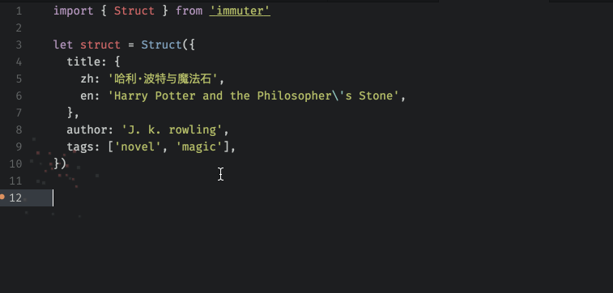

# Immuter

An immutable react/redux state update helper, easily handle nested state object with less code.


[](https://travis-ci.org/zaaack/immuter) [](https://www.npmjs.com/package/immuter) [](https://www.npmjs.com/package/immuter)


## Why

Facebook's Immutable.js is too heavy, seamless-immutable is lite and simple, and backwards-compatible with normal Arrays and Objects. But the way to update is not friendly enough for me, I have to write too much code for updating state. I also tried something like dot-prop-immutable, object-path-immutable, timm, updeep, update-immutable, etc. they all are good, but neither of them's DX is good enough for me, so I create this one based on all benefits of these.

## Install

```sh
npm i immuter

# or

yarn add immuter
```

## New Type-Safe Struct Feature!

Struct is a experiment feature, implemented by Proxy, highly inspired by [monolite](https://github.com/kube/monolite).

The most valuable part is it's clean API, write your code like language level support with immutable data. And because of this, it can work perfect with both flow and ts!

It's using es6 Proxy internally, but don't worry, since the structure is fixed, we can using [proxy-polyfill](https://github.com/GoogleChrome/proxy-polyfill) to support event IE 9!

### Notice

You can only change struct's deep properties by straight call, e.g.
```js
struct.a.b.c.d = ...

```
other wise you might be changing the copy, but there is no limitation for read.
The reason is that the child Proxy instances are cached for shallow compare.

If we don't want this limitation, we need to implement a specific compare function for struct data, and `===` won't work for cloned struct's child.



```js
import { Struct }

const struct = Struct({
  title: {
    zh: '哈利·波特与魔法石',
    en: 'Harry Potter and the Philosopher\'s Stone',
  },
  author: 'J. k. rowling',
  tags: ['novel', 'magic'],
})

const struct1 = Struct.clone(struct) // Clone struct, it will only change modified part to optimize performance.

struct1.author = 'New Author'
struct.author === 'J. k. rowling' // true
struct1.author === 'New Author' // true

struct1.title.en = 'New Title'

Struct.isStruct(struct) // true
```

## Demo

### Simple mutation method
```js

import Immuter from 'immuter'
// or import { bindObj, binComp, get, set, update, del } from 'immuter'
const book = {
  title: {
    zh: '哈利·波特与魔法石',
    en: 'Harry Potter and the Philosopher\'s Stone',
  },
  author: 'J. k. rowling',
  tags: ['novel', 'magic'],
}

let titleEn
let bookLite
let newBook = book


// get the English title
titleEn = Immuter.get(book, 'title.en')
// or
titleEn = Immuter.get(book, ['title', 'en'])
// return: Harry Potter and the Philosopher\'s Stone

// multiple get
bookLite = Immuter.get(book, {
  'title': 'title.en',
  'author': 'author',
}, {
  'type': 'book',
})
// return {
//  title: 'Harry Potter and the Philosopher\'s Stone',
//  author: 'J. k. rowling',
//  type: 'book'
// }

// set the English title
newBook = Immuter.set(newBook, 'title.zh', '新标题!')
// or
newBook = Immuter.set(newBook, ['title', 'en'], 'New title!')
// return:  {
//   title: {
//     zh: '新标题!',
//     en: 'New title!',
//   },
//   author: 'J. k. rowling',
//   tags: ['novel', 'magic'],
// }


// set array item
newBook = Immuter.set(newBook, 'tags[0]', 'New tag')

// update array, update is almost like the set, except the value is a function to update value,
// note this function should be pure!
newBook = Immuter.update(book, 'tags', tags => tags.concat(['UK']))
// return:  {
//   title: {
//     zh: '新标题!',
//     en: 'New title!',
//   },
//   author: 'J. k. rowling',
//   tags: ['New tag', 'magic', 'UK'],
// }


// multiple set
newBook = Immuter.set(newBook, {
  'title.en': 'New Title!',
  'author': 'New Author!'
})


// multiple update
newBook = Immuter.update(newBook, {
  'title.en': title => title + ' (Original Edition)',
  'author': author => author.toUpperCase(),
  'tags': tags => tags.concat(['UK']),
})

// multiple delete
newBook = Immuter.delete(newBook, {
  'title.zh': true, // this would be removed
  'author': false, // this won't
  'tags': false, // this won't, too
})
```

### Advance

#### bindObj
```js


import Immuter from 'immuter'

const book = {
  title: {
    zh: '哈利·波特与魔法石',
    en: 'Harry Potter and the Philosopher\'s Stone',
  },
  author: 'J. k. rowling',
  tags: ['novel', 'magic'],
}
let newBook = book
const immuBook = Immuter.bindObj(newBook)
const titleEn = immuBook.get('title.en')
newBook = immuBook.set('title.en', 'New title!')

immuBook.set('author', 'J.K')
newBook = immuBook.getObj()
```
#### bindComp

Using bindComp decorator to bind a React Component, with flowtype.

```js
import { Component } from 'react'
import Immuter from 'immuter'
import type { ImmuterGet, ImmuterSet, ImmuterUpdate, ImmuterDel } from 'immuter'

type State = {
  title: {
    zh: string,
    en: string,
  },
  author: string,
  tags: Array<string>,
}

@Immuter.bindComp()
class CompA extends Component {
  get: ImmuterGet<State>
  set: ImmuterSet<State>
  update: ImmuterUpdate<State>
  del: ImmuterDel<State>
  delete: ImmuterDel<State>
  state: State = {
    title: {
      zh: '哈利·波特与魔法石',
      en: 'Harry Potter and the Philosopher\'s Stone',
    },
    author: 'J. k. rowling',
    tags: ['novel', 'magic'],
  }

  componentDidMount() {
    this.update('title.en', title => title + ' (Original Edition)')
      .then((state) => {
        // do what you want in setState callback
      })
  }
}

```


## API

### Immuter.get: <T: Object>(obj: T, string | Array<string>, defaults: any) => any
Get a deep property by dot path or array path
> Note: get wouldn't deep clone result for performance issues, just make sure all your modify operations are using immuter :).


### Immuter.get<T: Object>(obj: T, path: { [string]: string | Array<string> }, defaults: { [string]: any }) => { [string]: any }
Get deep properties by an Object with custom key.

### Immuter.set<T: Object>(obj: T, string | Array<string>, value: any) => T
Set a deep property by dot path or array path

### Immuter.set<T: Object>(obj: T, pathValueMap: { [string | Array<string>]: any }) => T
Set deep properties by an Object with Path key

### Immuter.update<T: Object>(obj: T, string | Array<string>, updater: (val: any) => any) => T
Mostly like set, except passing a function to update value

### Immuter.update<T: Object>(obj: T, pathUpdaterMap: { [string | Array<string>]: (val: any) => any }) => T
Multi update with an  path: updater map

### Immuter.bindObj<T: Object>(obj: T, chain: boolean = false): ImmuterWrapper<T>
This function will return an ImmuterWrapper instance with all functions above as it's methods, and bind the obj inside, so you don't need to pass obj.
  * chain: default false, modify method would return the modified object directly, otherwise would return this for chained calls.


### Immuter.bindComp<T: Object>(ns: string | boolean=false, includes?: ?Array<string>, excludes: Array<string> = ['bindObj', 'bindComp'])

This function will bind immuter functions to React Component instance, you can get, set, delete or update component state directly with instance method `get`, `set`, `delete` or `update`.

* ns: Whether using namespace, defaults is false, means immuter functions would mount on component instance, you can call `this.get('title.en')`, `this.set('title.en', 'Some title')`, etc. in your component. Or using an special object to mount, e.g ns='immter', so you should call like this: `this.get('title.en')`, `this.set('title.en', 'Some title')`
* includes: An array of include methods, defaults is all.
* excludes: An array of exclude methods, defaults is ['bindObj', 'bindComp'].

These methods will auto update state by `this.setState`, if you need to using setState's callback feature, don't worry, all modify methods will return a promise, so you can even using async/await with it!

## Exported flow types for bindComp
```js
export type ImmuterGet = (path: GetPath, defaults: *) => *
export type ImmuterSet = <State>(path: SetPath, value: *) => State
export type ImmuterUpdate = <State>(path: UpdatePath, fn?: Updater) => State
export type ImmuterDel = <State>(path: DelPath) => State
```

## Licence MIT
